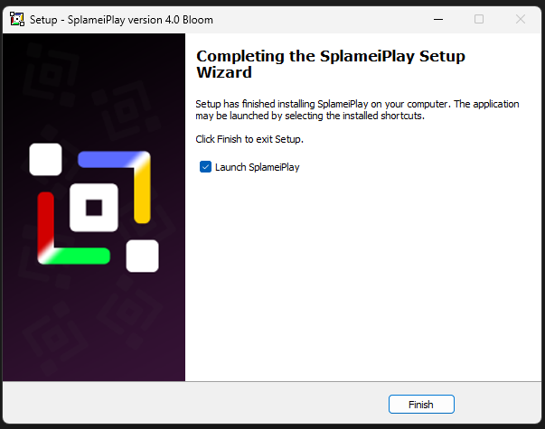

# Getting Started

Before you can use SplameiPlay you need to install it. You can do that through the [official download page](https://veemo.uk/splameiplay).

Once your own the page you'll want to do the following:

1. Scroll down to the 'Download' button and press it
2. Google Chrome may block the download because it's not downloaded alot
3. Extract the `.zip`  file and open the `SplameiPlay.exe` file. If Windows SmartScreen prompts a warning, tell it to run anyway
4. Follow the steps to complete the installer
5. Once finished, you should see the screen below:

<figure><figcaption></figcaption></figure>

Make sure that 'Launch SplameiPlay' is checked to start SplameiPlay.

SplameIPlay is now installed and ready to use and can be launched through the start menu
