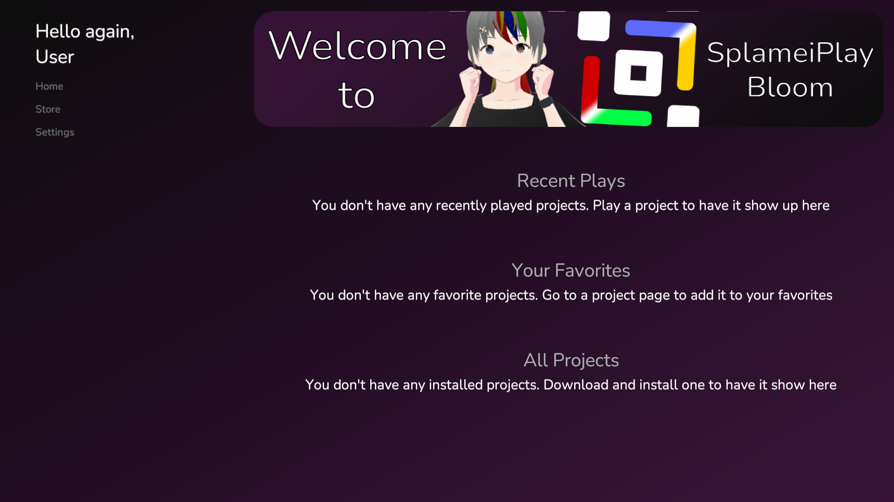

# Navigating

## Home

When you boot up SplameiPlay, you will see a screen similar to the image provided below:

<figure><figcaption>
The SplameiPlay Home
</figcaption></figure>

There are three main parts to the SplameiPlay Home UI. There are as follows:

* The side bar that can be found on the left side consisting of the main pages and the 'Hello Text' allowing you to navigate to the Home, Store and Settings page.
* The banner that can be found on the right top side. The image provided above shows the banner reading 'Welcome to SplameiPlay Bloom' When pressed, a project page or link will be opened.
* The main home page that is below the banner. It shows the top 3 recently played projects, your favourite projects then below, all the projects you have.

The home is where you can easily launch and update projects you already have installed or custom projects. When you boot SplameiPlay up for the first time, it will be empty. To get new projects, you can try downloading from the Store page that can be opened by pressed 'Store' from the sidebar.

## Store Page

Below, you will find what your store page will look similar too:

<figure><figcaption>
SplameiPlay Store Page
</figcaption></figure>

The Store is where you will download projects. They are split into sections for each of the publishers. You can press the project's button to open it's project page to learn about the projects and install/update it.

The store is always growing through each update so making sure your installation is up-to-date is important.

## Project Page

Below is what your project page will look similar too:

<figure><figcaption>
The Bitorpito Deluxe Project Page
</figcaption></figure>

This is how you launch and install a project. The sidebar can still be accessed to easily change what screen your on.

On the top right if the notices for the projects. This will show any notices for the project which may be update, events or other similar notices.

The bottom right houses the Action Button for downloading and installing a project and above, the favourite button to show the project above your installed projects in the home page.

<figure><figcaption>
The Bitorpito Deluxe Project Page but scrolled down
</figcaption></figure>

When you scroll down, you will see more information about the project such as the about text, specs, rating (age rating and any ratings from authorised reviewers), etc. You can also Uninstall the project or press 'More Info' to to open up the link specified by the project.

## Settings Page

For the settings page, press 'Settings' on the sidebar. For how to use settings and what all the options mean, check the [settings page on these docs](navigating.md#settings-page).
