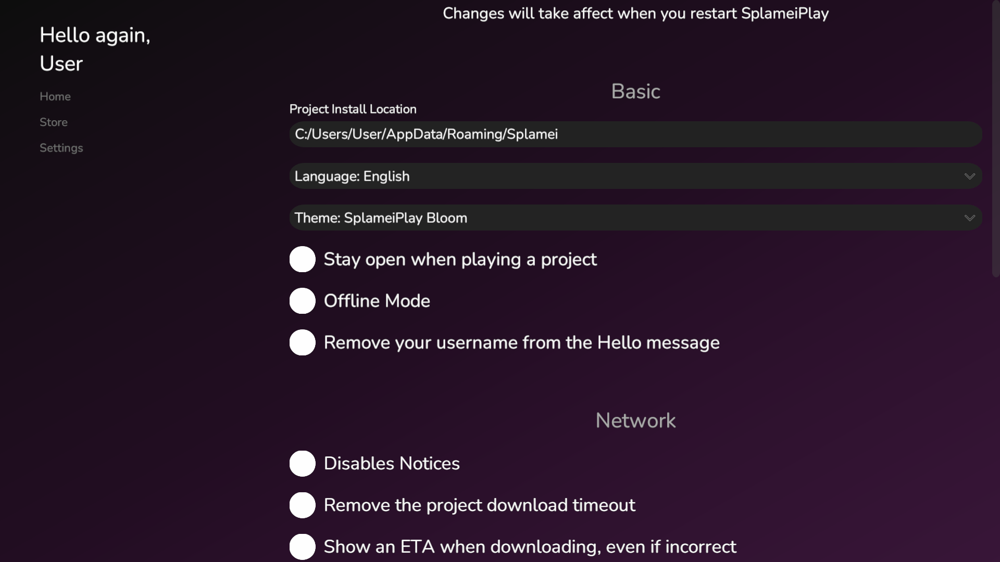

# Settings Page

To open the settings page, press 'Settings' in the side bar. This will send you to the settings page.

<figure><figcaption>
Settings Page
</figcaption></figure>

The settings page allows you to change how SplameiPlay runs and functions. Below you'll see all of the settings, allowed values and what they do.

| Catagory          | Setting Name                                    | Meaning                                                                                                                       | Default                                             |
| ----------------- | ----------------------------------------------- | ----------------------------------------------------------------------------------------------------------------------------- | --------------------------------------------------- |
| Basic             | Project Install Location                        | Where SplameiPlay will store newly downloaded projects                                                                        | C:/Users/\<yourName>/AppData/Roaming/Splamei        |
|                   | Language                                        | What language should be used                                                                                                  | Based on your system language (Fallback is English) |
|                   | Theme                                           | What theme will be used                                                                                                       | SplameiPlay Bloom                                   |
|                   | Stay open when playing a project                | If SplameiPlay should remain open when you play a project or if it should close                                               | Off                                                 |
|                   | Offline Mode                                    | If SplameiPlay should try using the internet                                                                                  | Off                                                 |
|                   | Remove your username from the hello text        | If SplameiPlay should say "Hello, \<yourname> or just "Hello"                                                                 | Off                                                 |
| Network           | Disable Notices                                 | If SplameiPlay should show notices when on a project page. Best of on metered networks                                        | Off                                                 |
|                   | Remove the project download timeout             | If SplameiPlay should stop trying to download a project if it takes too long to progress                                      | Off                                                 |
|                   | Show an ETA when downloading                    | Always show an ETA when downloading. Best off since you may get an ETA that is way off                                        | Off                                                 |
| Projects          | Add a custom project                            | Add a custom project to the app (more information on the next page)                                                           |                                                     |
|                   | Remove Author name on custom projects           | Whether SplameiPlay should show the author of a project with custom projects                                                  | Off                                                 |
| Recap + DiscordRP | Disable recap                                   | If Recap should be disabled. This will interfere with it so it's best to keep off so you get an accurate yearly recap.        | Off                                                 |
|                   | Disable Discord Rich Presence (Trial)           | If Discord Rich Presence (shows your using SplameiPlay) should be disabled. (Discord needs to be installed and 4.2 Bloom+)    | Off                                                 |
|                   | Hide project names within Rich Presence (Trial) | If the project your using should show within Discord (4.2 Bloom+)                                                             | Off                                                 |
| Advanced          | Release Channel                                 | The release channel that SplameiPlay should use. To prevent issues and problems with SplameiPlay, this should stay on stable. | Stable                                              |
