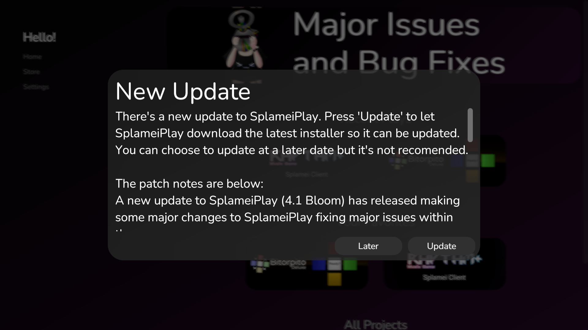

# Updating SplameiPlay

SplameiPlay (unless offline mode is on) will check for updates once every day. If it finds a new update, you will be notified about it.


It's recommended to update SplameiPlay when there is a new update so you get the latest improvement and changes. Not updating may cause SplameiPlay to stop working or malfunction


<figure><figcaption>
SplameiPlay Update screen
</figcaption></figure>

On SplameiPlay 4.0 Bloom and newer, pressing 'Update' will have SplameiPlay download the newest installer and open it so SplameiPlay can keep itself updated. The app will be unavailable during the update.

On versions before 4.0 Bloom, pressing 'Update' will open the official download page and require manually updating.

SplameiPlay should be closed when updating to prevent issues while updating

## Checking your installed version

To check your installed version, go into settings, scroll down and find where it says 'SplameiPlay Version' to see the store's version. i.e. `SplameiPlay Version: 4.8 Bloom`
